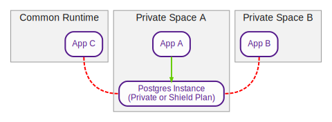
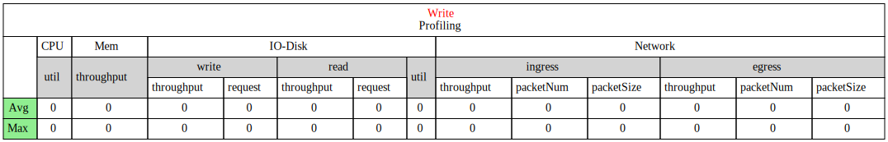

# Demo Project for graphviz

1. Draw Tables With HTML

2. Draw Directed Graph

## How to Generate Graph?
```bash
apt install graphviz
dot -Tsvg demo1.html -o demo1.svg
dot -Tpng demo2.html -o demo2.png
dot -Tps demo1.digraph -o demo1.ps
```


## Output Example:



